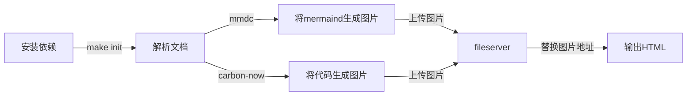

# md-code2img

一个将Markdown的代码，Mermaid时序图代码转换为图片，生成HTML的工具。为了方便适配各大写作平台代码排版问题，因为图片是最为直观的展示。

## Usage

```bash
make init
# 远程部署fileserver.php
# 修改config.php中的endpoint和密钥sign

php create.php xxx.md > data/index.html

cat data/index.html

# 启动服务
make serve
```

## 实现流程



## 相关命令

- 将mermaind代码生成图片
  ```bash
  # -e png 生成的图片文件类型为png
  mmdc -i README.md -o data/new.md -e png
  ```
- 将代码生成图片
  ```bash
  # -h 无头浏览器
  # -t 文件hash
  # code.txt代码文件，这里获取markdown中的代码块，生成的临时文件
  carbon-now code.txt -t 0-5470dcb49927592 -h
  ```

## 项目代码

> git@github.com:deliangyang/md-code2img.git